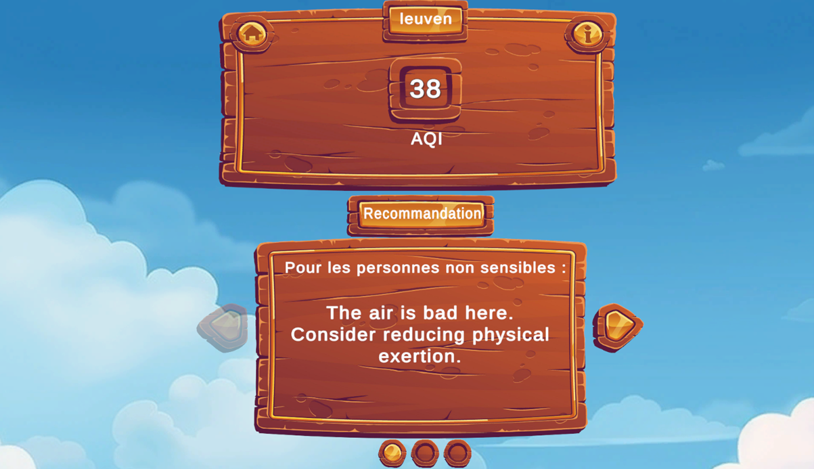
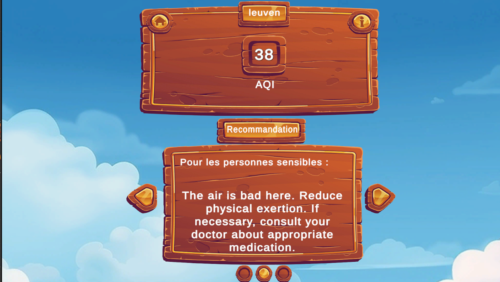
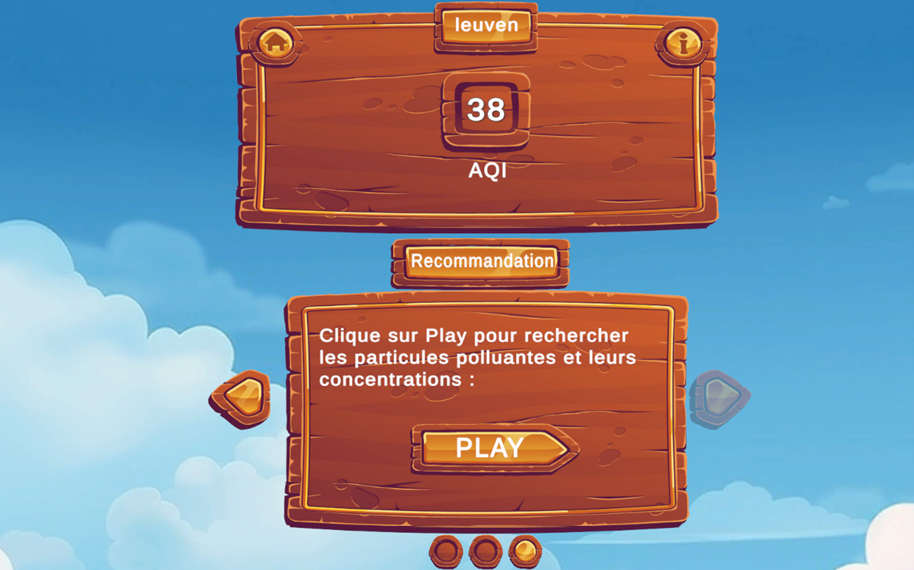
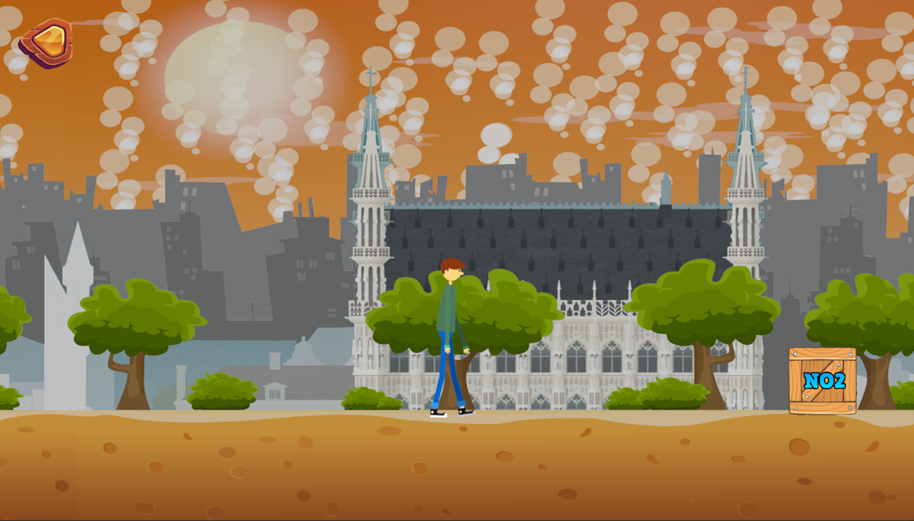
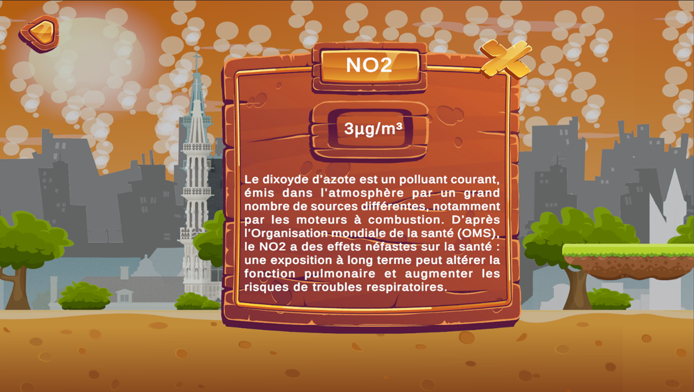
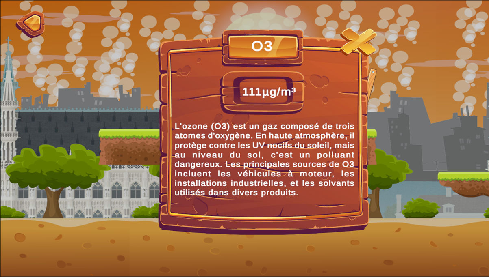

# Air Quality Game

This is a small game made with Unity.  
The goal is to learn about air pollution and have fun!

## How it Works

### 1. Choose a City
First, the player chooses a city.  

### 2. Air Quality Information
Then, the game shows air quality information for the city:

- AQI (Air Quality Index)
- Advice for sensitive and non-sensitive people  
  *(For example: "Can I open my windows or not?")*  
 
 
 

### 3. Start the Game
After that, the player clicks a button to start the game.  
 

### 4. Game Play
The game starts!  
The player controls a character who must find pollution particles and avoid obstacles.  
The background changes depending on the city (for example: Atomium for Brussels).  
 
  

### 5. Learn About Pollution
When the player finds a box (NO₂, O₃, PM10, PM2.5), a window appears:

- It shows the quantity of the particle in the chosen city.
- It provides simple information about the particle.

This way, the player learns about pollution while playing!
 

## Contributing

Feel free to open issues or pull requests if you'd like to contribute to the game!

